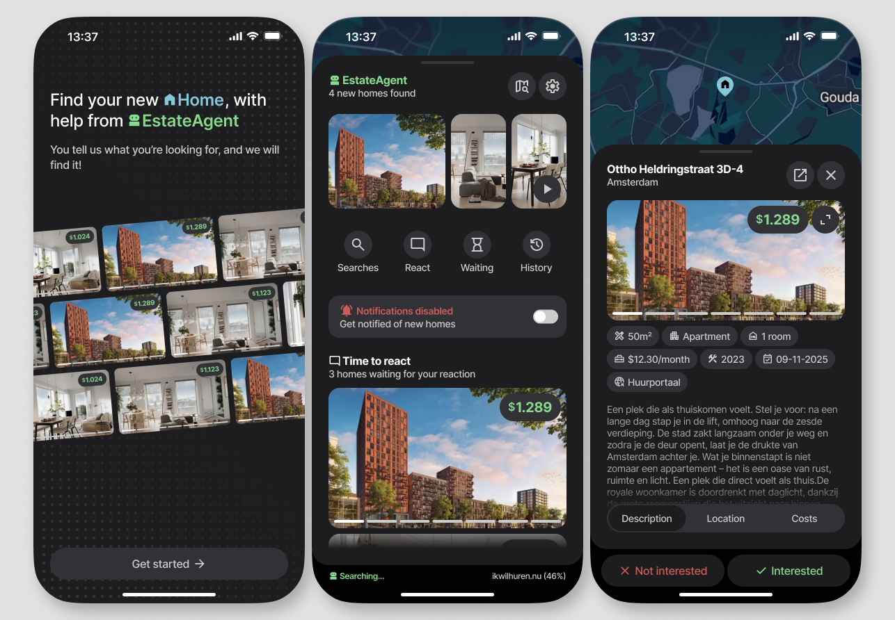
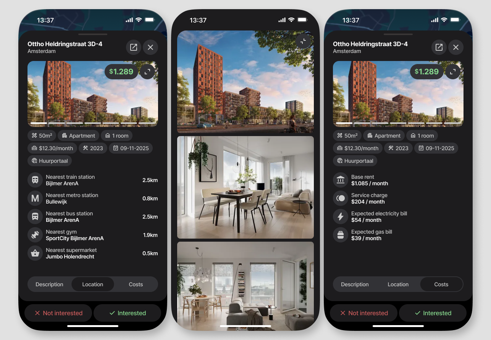
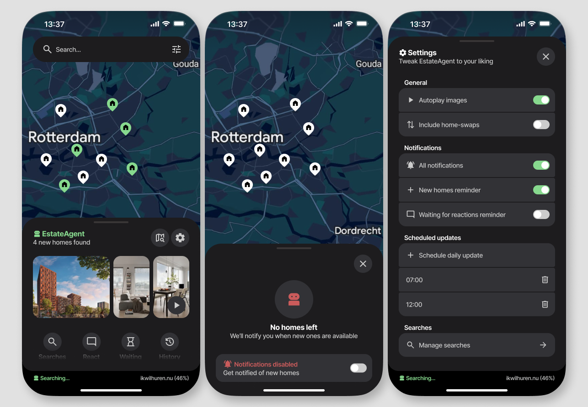

# EstateAgent

EstateAgent is an Android app that aggregates rental listings from multiple Dutch housing platforms into a single application. It focuses on scraping, data normalization, and presenting results through a modern Compose-based UI.

_Disclaimer: This is a personal side project. It is not intended for production nor distribution_

_Status: This is a work in progress_

## Tech Stack

- Kotlin
- Jetpack Compose
- Jetpack Navigation3
- Ktor (networking / scraping)
- Room (local caching)
- Koin (dependency injection)
- Google Maps API (SDK for map + REST API for geocoding)

## Architecture

The project follows Clean Architecture. It is modularized and split into the following layers: 

- `app` - UI code, navigation and app definition
- `presentation` - ViewModels following MVVM architecture
- `domain` - Use cases and repository interfaces. Holds business logic
- `data` - Scraping and local storage

Each platform scraper is isolated and maps raw data into a unified domain model before persistence.

## Focus Areas

- Multi-source data aggregation
- HTML/data scraping and normalization
- Caching strategy with Room (and optimized scraping based on this)
- Background map which follows above UI state and can also be used separately

## Screenshots

